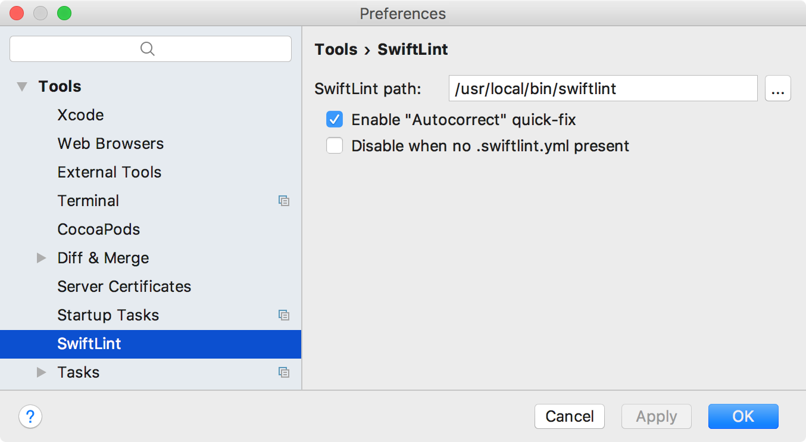
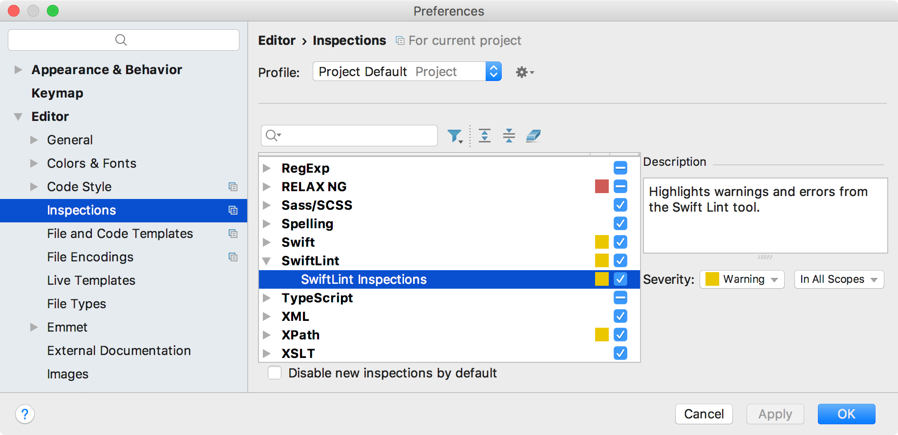

## SwiftLint for AppCode

This simple plugin allows to highlight errors and warnings from [SwiftLint](https://github.com/realm/SwiftLint) like this:

### Installation

You should already have SwiftLint installed somewhere.
 1. Configure SwiftLint via `.swiftlint.yml` file, if needed. See [here](https://github.com/realm/SwiftLint#configuration) for details.
 
    Note that the plugin works with `reporter: "xcode"`.
    
 2. Install the plugin from the repository.
 
 3. Set path to SwiftLint binary in the Preferences:

    

 4. Adapt AppCode's inspection settings to your liking:
 
     

You are good to go!
