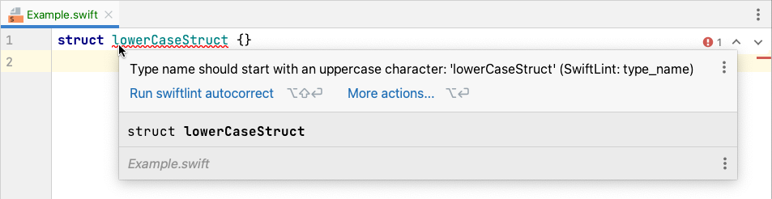

# SwiftLint for AppCode

This plugin shows errors and warnings from [SwiftLint](https://github.com/realm/SwiftLint)
in [JetBrains AppCode](https://www.jetbrains.com/objc/).

Screenshot: 

## Install
1. Install `swiftlint` binary from <https://github.com/realm/SwiftLint>
2. Install plugin
   - Open AppCode Preferences and go to Plugins.
   - Click the Marketplace tab
   - Enter "SwiftLint" in the search box
   - Click Install
   - Click OK
3. Restart AppCode
4. Set `swiftlint` binary path (per project setting, should be OK by default but who knows)
   - Open AppCode Preferences and go to Tools > SwiftLint.
   - Update the "SwiftLint binary path" box
   - 

Screenshot

     
     

5. Enable inspection (per project setting)
   - Open AppCode Preferences and go to Editor > Inspections.
   - Check the box next to Swift > "SwiftLint (available for Code|Inspect Code)"
   - 

Screenshot

     
     

## Use
Lint errors appear in your code as red underlines, orange highlighting. This depends on severity.

How to configure the lint rules:
1. Create a file called `.swiftlint.yml` in the root directory of your project.
2. Add rules configuration there. Consult the docs: <https://github.com/realm/SwiftLint#rules>

How to disable rules in code: <https://github.com/realm/SwiftLint#disable-rules-in-code>.
There is an autocompletion for that. Just try autocompletion inside the comment.

## Develop the Plugin

This is a DevKit plugin. And it is old, so be prepared. 

You will need:
 - JDK 11 (I use OpenJDK)
 - IntelliJ Idea with "Plugin DevKit" plugin enabled
 - These sources
 - You will need to set up project SDK (as IntelliJ SDK) correctly:
   - File -> Project Structure -> SDKs -> "+" button
   - Add IntelliJ Platform Plugin SDK...
   - Select "AppCode.app" (needed version)
   - Now you need to add some plugins from AppCode so that code can compile. They all are inside `AppCode.app/contents/plugins` folder. 
     Add them on `Classpath` tab of SDK configuration page.
     - cidr-cocoa-plugin/lib/cidr-cocoa-plugin.jar
     - c-plugin/lib/c-plugin.jar
     - cidr-base-plugin/lib/cidr-base-plugin.jar
     - swift-plugin/lib/swift-plugin.jar
   - (You can also configure other things like Sourcepath and Documentation paths if you want, they are not requried)
 - Select created SDK in "Project Structure -> Project -> SDK"
 - Press OK button in Project Structure window
 - After that plugin should compile and run.
 - To pack it, you can use "Build/Prepare Plugin Module 'SwiftLint' For Deployment" menu. zip will appear in `.idea` folder, 
   because it appears where .iml file is, and I put it into .idea folder.